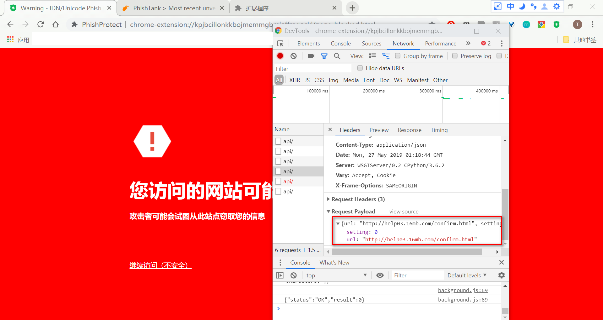
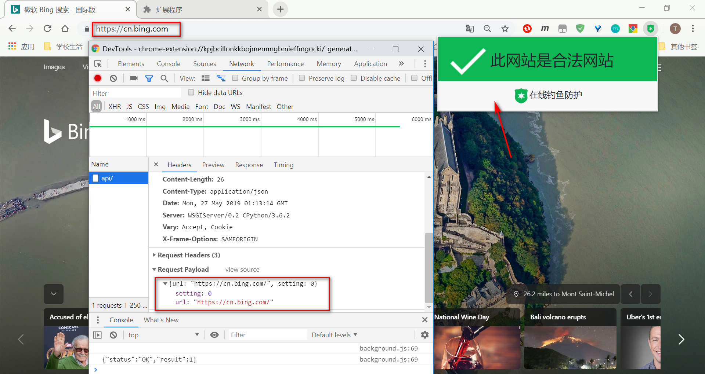
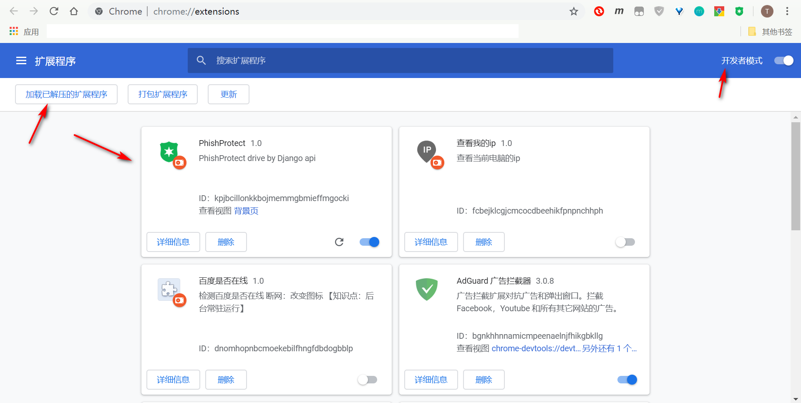
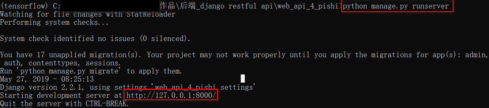
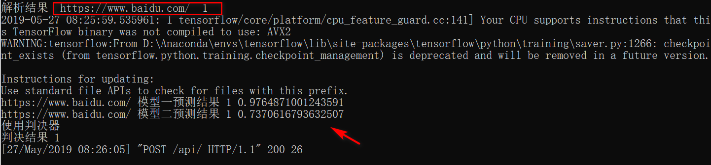

#### 基于机器学习的在线钓鱼检测框架

##### 目录介绍

BackEnd_django_restful_api：后端 python Django 后台服务程序
FrontEnd_browser_plug_in:  前端 浏览器插件

##### :christmas_tree:后端搭建

- Django框架  RESTful接口
- Tensorflow 

##### :partly_sunny:前端插件

- Chorme浏览器插件

##### 

##### 基本原理

- 前端

  - 插件每打开一次页面的时候将url信息发送到后台
  - 根据返回的信息进行拦截或放行

- 后台

  - 根据传输过来的URL提取信息
    - URL
    - 页面特征 （连接数量，外链比例，域名注册时间等）

  - 将特征送入模型进行预测
  - 将结果返回前端

##### 页面效果

